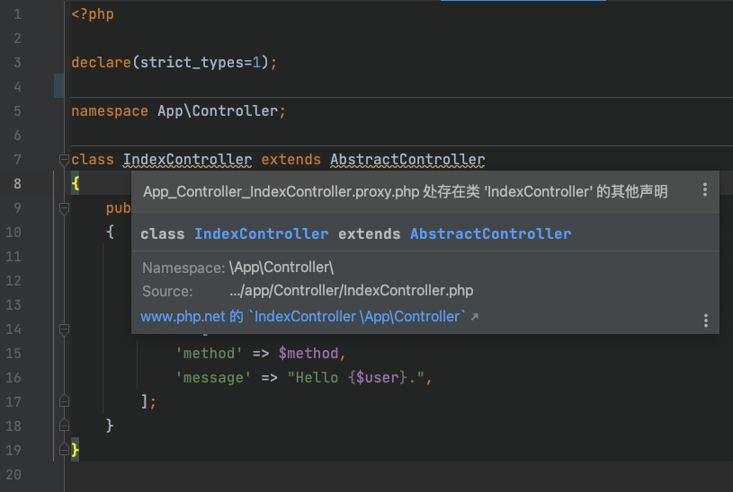
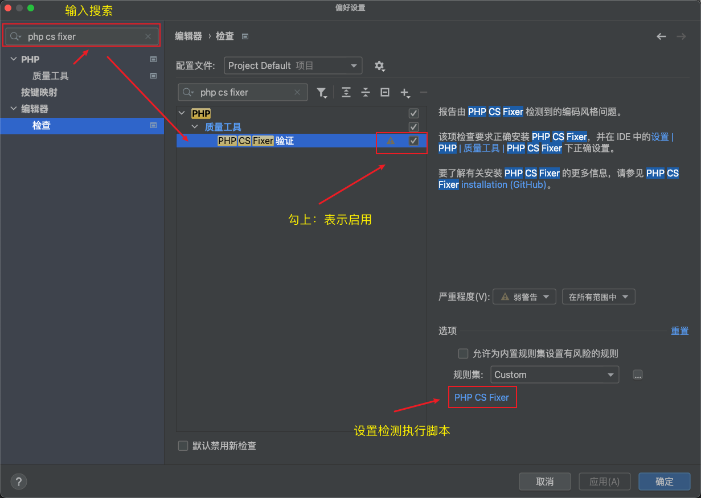
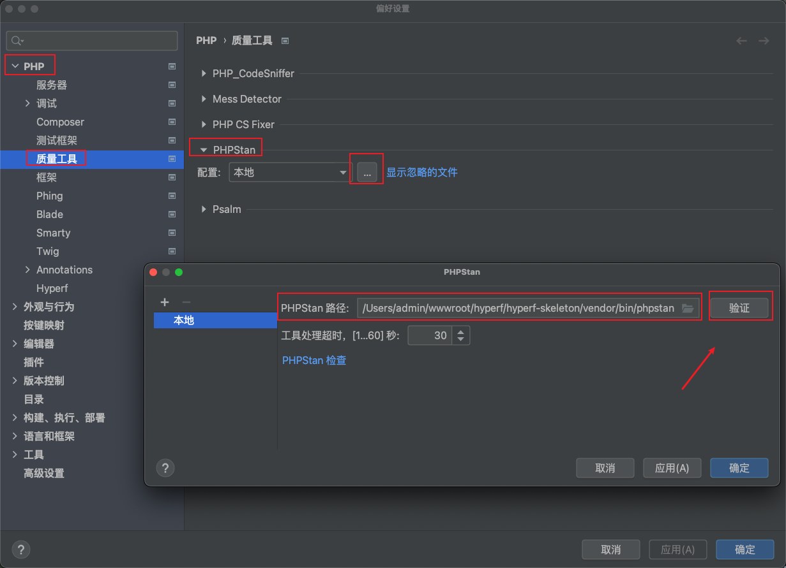
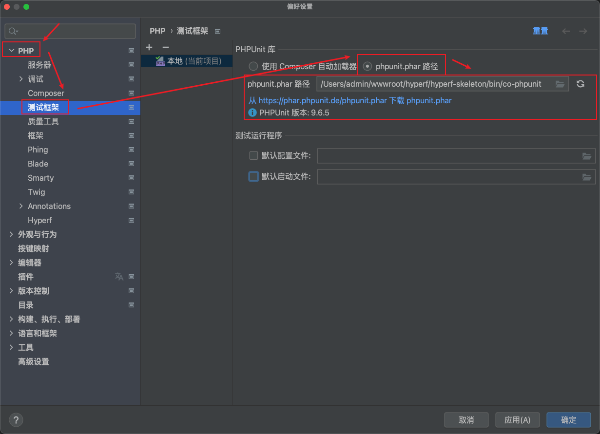
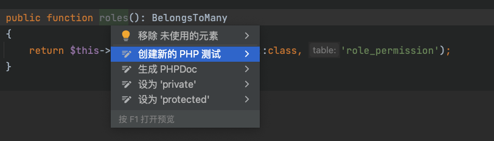
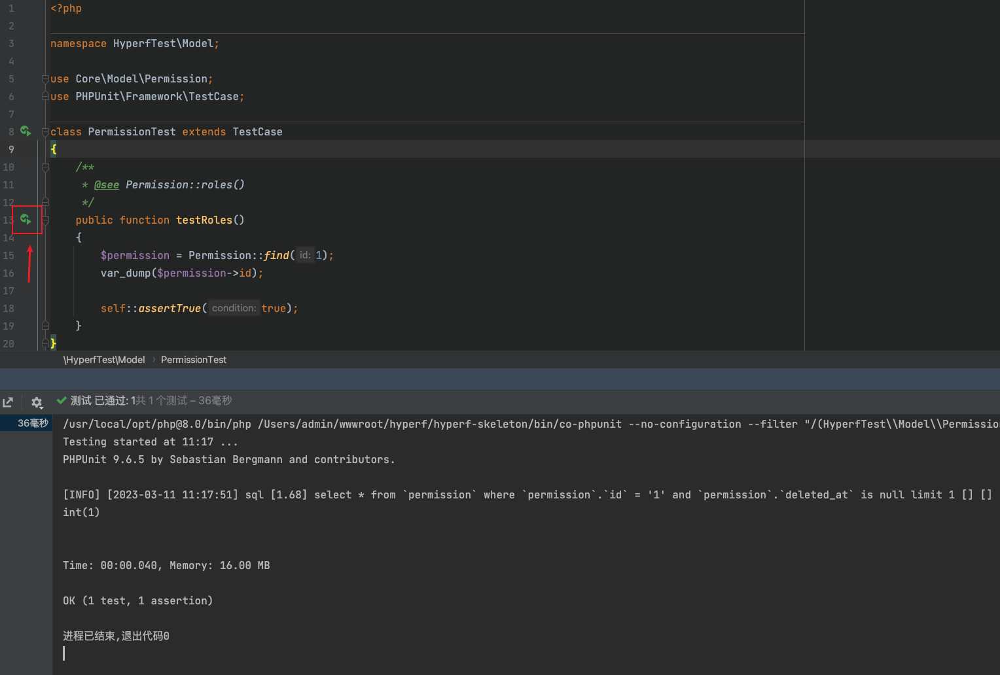

# 一、项目介绍

Hyperf 3.0.x 中台基础骨架

功能特性：

- 多租户多应用模式
- RBAC 权限管理
- 验证码生成和验证服务
- 多平台短信发送服务
- 多平台文件上传服务
- 数据表导入导出服务
- Hyperf 自身秒级定时任务 ( 不用通过 Linux 的 crontab 命令实现 )
- Hyperf 自身 Redis 实现延时消息队列
- 等等

总后台功能：

说明：总后台为单租户模式，锁死租户 `id = 1` ( 配置 [config/autoload/tenant.php](config/autoload/tenant.php) )

[接口文档](https://console-docs.apipost.cn/preview/43be93cdd14fb944/383cf50523192a4a)

- 公共 ( 无需登录 )
  - 用户登录
    - [x] **手机号+密码** 登录 ( 登录错误次数限制 )
    - [x] **手机验证码** 登录
      - [x] 验证码 1 分钟内发送 1 次限制
- 公共 ( 需要登录 )
  - [x] [文件上传](https://github.com/thephpleague/flysystem) ( 支持: 本地 | FTP | 阿里云 | 腾讯云 | 七牛云 | AWS S3 | 内存 )
  - [x] 菜单列表 ( 树 )
  - [x] 用户刷新 Token
  - [x] 我的 ( 个人中心 )
    - [x] 详情
    - [x] 修改密码 ( 通过 _旧密码_ 修改 )
    - [x] 修改密码 ( 通过 _手机验证码_ 修改 )
    - [x] 更换手机号
- 用户管理
  - [x] 列表
  - [x] 详情
  - [x] 创建
  - [x] 修改
    - [x] 可直接修改手机号，并忽略自身手机号去重处理
    - [x] 不可修改密码
  - [x] 重置密码
  - [x] 删除
  - [x] 启用
  - [x] 禁用
- 角色管理
  - [x] 列表
  - [x] 详情
  - [x] 创建
  - [x] 修改
  - [x] 删除
  - [x] 启用
  - [x] 禁用
  - [x] 绑定权限
- 权限管理
  - [x] 列表
  - [x] 详情
  - [x] 收集
    - [x] 异步协程自动执行 [ 收集权限 ] 命令行 `php bin/hyperf.php collect:permissions`
  - [x] 修改
  - [x] 删除
- 菜单管理
  - [x] 列表
  - [x] 详情
  - [x] 创建 ( 含：权限绑定 )
  - [x] 修改 ( 含：权限绑定 )
  - [x] 删除
  - [x] 启用
  - [x] 禁用
- 应用管理 ( 初期直接管理数据库，后面再实现 )
  - [ ] 列表
  - [ ] 详情
    - 租户管理 ( 应用下的租户 )
      - [ ] 列表
      - [ ] 详情
      - [ ] 创建
      - [ ] 修改
      - [ ] 启用
      - [ ] 禁用
        - 用户管理 ( 租户下的用户 )
          - [ ] 列表
          - [ ] 详情
    - 角色管理
      - [ ] 列表
      - [ ] 详情
      - [ ] 创建
      - [ ] 修改
      - [ ] 启用
      - [ ] 禁用
    - 用户管理 ( 应用下的用户 )
      - [ ] 列表
      - [ ] 详情

# 二、环境要求

Hyperf 对系统环境有一定的要求，它只能在 Linux 和 Mac 环境下运行，但由于 Docker 虚拟化技术的发展，Docker for Windows 也可以作为 Windows 下的运行环境。

Dockerfile 的各个版本： [hyperf/hyperf-docker](https://github.com/hyperf/hyperf-docker)，或直接基于已经构建的 [hyperf/hyperf](https://hub.docker.com/r/hyperf/hyperf) Image 运行。

当你不想使用 Docker 作为运行环境的基础时，你需要确保你的操作环境满足以下要求:

- PHP >= 8.1
- [ext-swoole](https://pecl.php.net/package/swoole) >= 5.0 ( php.ini swoole.use_shortname=Off 配置为关闭 )
- ext-json
- ext-pcntl
- ext-openssl ( 如需要使用到 HTTPS )
- ext-pdo ( 如需要使用到 MySQL 客户端 )
- ext-redis ( 如需要使用到 Redis 客户端 )
- ext-protobuf ( 如需要使用到 gRPC 服务端或客户端 )

> 依赖性注意：
> 1. swoole 4.8.x 需要 php7.2 +
> 2. swoole 5.x.x 需要 php8.0 +

# 三、安装或更新依赖、数据库表和基础数据

## 1. 安装获更新依赖，以后如果需要更新依赖则执行更新命令即可

```bash
# 安装依赖 ( 默认 php 版本 8.0.x )
composer install
# 安装依赖 ( 指定 php 版本 )
# /usr/local/opt/php@8.0/bin/php /usr/local/bin/composer install

# 更新依赖 ( 注意：后面要加上 -o，这样依赖变更时才会生成新的 class_map )
composer update -o
# 更新依赖 ( 指定 php 版本 )
# /usr/local/opt/php@8.0/bin/php /usr/local/bin/composer update -o

############ composer 遇到问题 ############

# composer 升级到最新版
composer self-update

# 不用国内全量镜像，用默认的官方镜像
```

关于 `-o` 说明

Hyperf 自从 2.0 开始，需要使用到 composer 生成的 class_map，这就要求用户每次更新依赖都要使用 `-o` 进行优化， 但很多用户从来没有这个习惯。
于是我们在 composer.json 中增加对应配置，以满足这个需要，Hyperf 3.0.x 默认已经加上。

```json
{
    "config": {
        "optimize-autoloader": true,
        "sort-packages": true
    }
}
```

## 2. 配置 .env

复制 [.env.example](.env.example) 并重命名为 `.env`，然后配置好数据库和 Redis 等

## 3. 数据库迁移：

```bash
# 初始化数据表和基础数据
# 账号: admin 密码: 123456
php bin/hyperf.php migrate
```

# 四、常见问题

开发前，建议先把这 10 多个常见问题先看一遍，大概花 10+ 分钟

https://hyperf.wiki/3.0/#/zh-cn/quick-start/questions

# 五、PhpStorm 推荐配置

- 授人以渔 你懂的: https://github.com/lixiaokai/ja-netfilter-all
- PhpStorm 2022.3 最新变化: https://www.jetbrains.com.cn/phpstorm/whatsnew/
- PhpStorm 2022.2 最新变化: https://www.jetbrains.com.cn/phpstorm/whatsnew/2022-2/
- PhpStorm 2022.1 最新变化: https://www.jetbrains.com.cn/phpstorm/whatsnew/2022-1/

## 1. /runtime 目录设为排除目录

在左侧项目目录中选择根目录中的 runtime 文件夹 > 鼠标右键 > Mark Directory as ( 中文：将目录标记为 ) > Excluded ( 中文：已排除 )

**为什么 ？**

> 
> 1. 如上，由于该目录下会生成代码类似的代理文件，如果不设置排除 PhpStorm 的类名会出现波浪线，鼠标放上去会提示 [ 存在类 'xxxxx' 的其他声明 ]
> 
> 
> 2. 如上，按住 `Ctrl` 跳转时出现 2 个选择声明，需要手动选择正确的声明文件

## 2. .php-cs-fixer.php 团队代码风格统一和质量检测配置


1. 打钩启用：设置 -> 搜索 `php cs fixer` 然后勾上启用


2. 配置检测执行脚本，如果验证不通过注意看错误提示信息，比如默认 php 版本是否 8.0.x 等会导致这里检测失败

## 3. 推荐安装插件 ( Plugins )

- .env files support
- PHP Annotations

## 4. PhpStorm 识别协程上下文获取后的结果类型

通常我们使用 `Context::get()` 协程上下文获取结果时，PhpStorm 是不知道结果返回类型的 ( 也就是不知道结果是否个某个类实例还是个啥？ )，
通过下面的配置使得 PhpStorm 可以识别到

修改根目录文件 [.phpstorm.meta.php](.phpstorm.meta.php)，如下代码

```php
<?php

namespace PHPSTORM_META {

    // Reflect
    override(\Psr\Container\ContainerInterface::get(0), map('@'));
    override(\Hyperf\Context\Context::get(), map([
        'user' => \Core\Model\User::class,     // 定义结果返回类型 Context::get('user')
        'tenant' => \Core\Model\Tenant::class, // 定义结果返回类型 Context::get('tenant')
        0 => '@'
    ]));
    override(\make(0), map('@'));
    override(\di(0), map('@'));

}
```

## 5. PhpStorm 自动化单元测试配置



步骤 1：如上图，指定 PHPUnit 库路径并保存即可

注意：该 [bin/co-phpunit](bin/co-phpunit) 拷贝自 [vendor/bin/co-phpunit](vendor/bin/co-phpunit)，并做了一些修改才能兼容，切需要放在根 `bin` 目录下



步骤 2：如上图，鼠标放到类名或方法名中，按下 ( MacOS：Alt + Enter ) 然后选择 [ 创建新的 PHP 测试 ] ，这时会弹出一个提示框，根据操作即可



步骤 3：如上图，写好测试代码，点左侧三角图标运行即可

# 六、常用命令

## 启动项目

```bash
# 开发环境 ( 热更新模式 )
composer dev

# 生产环境
composer start

# kill 进程 ( 注意 .env 环境配置中的端口号是否和 .composer.json 中的配置一致 )
composer kill
```
如上，利用了 composer scripts 的自定义脚本实现

这将在端口 `9501` ( 同 .env 环境配置中的端口 ) 上启动 `cli-server`，并将其绑定到所有网络接口。

即可通过域名 ( 或 IP ) 访问 http://localhost:9501 ( 或 http://127.0.0.1:9501 )

# 七、目录结构

## 1. 目录结构

```
├─ app            // 各端应用
│  ├─Admin        // 总后端
│  ├─Common       // 公共资源端 ( 不需要权限验证，部分可能需要登录鉴权 )
│  ├─Demo         // 示例端
├─ bin            // 入口文件
├─ config         // 配置文件
├─ core           // 公共基类 ( 继承 kernel 中的基类，一般开发人员可修改 )
├─ kernel         // 内核基类 ( 后面会把这目录制作成组件，一般由底层开发人员维护 )
├─ public         // 对外公共资源目录
│  ├─attachment   // 本地附件存储
│  ├─static       // 静态资源目录
├─ storage        // 语言文件
```

说明：
1. 建议使用注解路由 ( 不使用配置路由 )，直接在对应的控制器上写注解即可
2. MVC 模式上加了服务层 ( Service ) 和仓库层 ( Repository )
3. 分层调用顺序：控制层 -> 服务层 ( 业务逻辑层，可以调用其他服务层 ) -> 仓库层 ( 数据逻辑层 ) -> 模型层
4. 关于视图层 ( 即 API 资源层 )：在控制器中获取服务层的返回数据，传入 API 资源层然后返回即可
5. 关于验证层：在控制器中以参数的形式注入方法即可，然后调用 `$request->validated()` 获取验证后的数据
6. 具体可参考演示控制器 [app/Demo/Controller/TestController.php](app/Demo/Controller/TestController.php)

## 2. [ 根目录 ] 增加 "文件夹" 时需修改如下 3 处位置

### 1. [composer.json](composer.json) 增加自动加载目录 ( autoload )
```json
{
  "autoload": {
    "psr-4": {
      "App\\": "app/",
      "Core\\": "core/",
      "Kernel\\": "kernel/"
    },
    "files": []
  }
}
```

### 2. [config/autoload/watcher.php](config/autoload/watcher.php) 增加热更新目录
```php
return [
    'driver' => ScanFileDriver::class,
    'bin' => 'php',
    'watch' => [
        'dir' => ['app', 'config', 'core', 'kernel', 'vendor'],
        'file' => ['.env'],
        'scan_interval' => 2000,
    ],
];
```

### 3. [config/autoload/annotations.php](config/autoload/annotations.php) 增加注解扫描目录
```php
return [
    'scan' => [
        // 注解扫描的目录
        'paths' => [
            BASE_PATH . '/app',
            BASE_PATH . '/core',
            BASE_PATH . '/kernel',
        ],
        // 忽略的注解名
        'ignore_annotations' => [
            'mixin',
        ],
    ],
];
```


# 八、脚手架开发者工具

官网文档：https://hyperf.wiki/3.0/#/zh-cn/devtool

## 1. 查看支持的命令

```bash
php bin/hyperf.php
```

## 2. 常用命令
> `-N "命名空间"`：命名空间需要用单引号或双引号包裹，反斜线可以用单或双反斜线
> 
```bash
# 生成：模型
php bin/hyperf.php gen:model user # user 表示 [ mysql 表名 ] 这里用小写

# 生成：控制器
php bin/hyperf.php gen:controller DemoController # 首字母大写
php bin/hyperf.php gen:controller DemoController -N "App\Demo\Controller" # 指定命名空间

# 生成：API 资源
# 文档：https://hyperf.wiki/3.0/#/zh-cn/db/resource
# 注意：config/autoload/devtool.php 配置中默认没有 API 资源的配置，需要自己手动加上 ( 该项目已加上 )
php bin/hyperf.php gen:resource UserResource # 首字母大写
php bin/hyperf.php gen:resource UserResource -N "App\Demo\Resource" # 指定命名空间
php bin/hyperf.php gen:resource UserCollection --collection # 生成集合
php bin/hyperf.php gen:resource UserCollection # 资源的名称中包含 Collection 名则不需要 --collection 参数

# 生成：监听
php bin/hyperf.php gen:listener DemoCteateListener # 首字母大写

# 生成：中间件
php bin/hyperf.php gen:middleware DemoMiddleware # 首字母大写

# 生成：APO 切面
php bin/hyperf.php gen:aspect DemoAspect # 首字母大写

# 生成：命令行
php bin/hyperf.php gen:command DemoPermissions # 首字母大写

# 生成：迁移
# 文档：https://hyperf.wiki/3.0/#/zh-cn/db/migration
php bin/hyperf.php gen:migration create_users_table --create=user # --create 创建表
php bin/hyperf.php gen:migration update_users_table --table=user  # --table 修改表
php bin/hyperf.php migrate                   # 运行
php bin/hyperf.php migrate:rollback          # 回滚
php bin/hyperf.php migrate:rollback --step=2 # 回滚最近的 2 次迁移
php bin/hyperf.php migrate:reset             # 回滚所有迁移
php bin/hyperf.php migrate:refresh           # 回滚并迁移 ( 高效重建迁移 )

# 生成：进程
php bin/hyperf.php gen:process DemoProcess # 首字母大写

# 生成：异步队列 - 消费任务
php bin/hyperf.php gen:job DemoJob # 首字母大写

# 生成：异步队列 - 生产者 + 消费者
php bin/hyperf.php gen:amqp-producer DemoProducer # 首字母大写 ( 生产者 )
php bin/hyperf.php gen:amqp-consumer DemoConsumer # 首字母大写 ( 消费者 )
```

## 3. 自定义命令

```bash
# 权限收集 ( 可重复执行 )
php bin/hyperf.php collect:permissions
```

## 4. 执行数据填充
```bash
php bin/hyperf.php db:seed --path=seeders/DemoSeeder.php # 指定具体文件
```

**注意：创建时的默认 [ 命名空间 ]**

> 既：根据 [ 命名空间 ] 会自动创建 [ 保存目录 ]
>
> 1. 通常配置文件：[config/autoload/devtool.php](config/autoload/devtool.php)
> 2. 特例配置文件：[config/autoload/databases.php](config/autoload/databases.php) `gen:model` 创建模型时是在数据库配置文件

##  5. 发布配置
```bash
# 发布 Redis 消息异步队列配置 ( 如果要发布其他组件的配置，直接修改最后的组件名即可 )
php bin/hyperf.php vendor:publish hyperf/async-queue
```
##  6.干起来
```bash
docker run --name hyperf \
-v /home/phillu/code/php/Hospital:/data/project \
-w /data/project \
-p 9501:9501 -it \
--privileged -u root \
--entrypoint /bin/sh \
hyperf/hyperf:8.1-alpine-v3.18-swoole
```